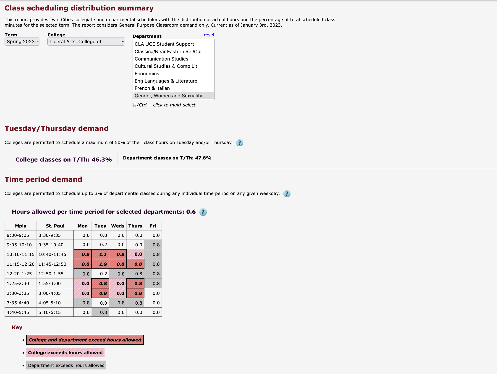

theme: Inter, 4
footer: https://z.umn.edu/databricks_asr

# [fit]Azure Databricks

---

# Getting Data

[.column]
## Query ➡

- PeopleSoft
- uAchieve
- DORS
- Etc.

[.column]
## Transform ➡

- Filter
- Flatten
- Convert
- Etc.

[.column]
## Save
- Oracle
- Tableau
- BI
- Etc.

---

# Current Approaches

1. Application Development Team
2. OIT/EDMR

---

# Downsides

- Changes need to go back through App Dev or OIT
- The solution is maintained by people unfamiliar with the data
- Solutions are usually single use

---

# Example
## CSDS

---

# Example
## CSDS

- Changes to data must be done by App Dev
- App Dev are not experts in Class Scheduling data
- No one else can use this data

---

# Solutions

- Works with a variety of data
- Lets people manage data they know and need
- Cloud based

---

# Data Lake(houses)

- Lots of options in this space
- Modern way of managing and analyzing data
- Similar to a Data Warehouse, but more flexible

---

# Databricks

- Cloud hosted data lakehouse
- Well integrated with Azure, OIT's preferred cloud

---

# Databricks

- Store data from many sources
- Send data to many targets
- Easy transformation
- Lots of automation options
- Analytics

---

# [fit] CSDS in Databricks

---

# Goals

- Easy to load data in from a variety of sources
- Data and Business Analysts can manage data they use
- Resulting data can be used by multiple systems and people

---

# Query

---

# Transformation Process

---

# Transformation Results

---

# Load

---

# Databricks
## Benefits

- We can store data from multiple sources in many formats
- We can let data experts transform or analyze that data
- The results of their work can be used by others

---

# Databricks
## Differences from other systems

- Boomi API
- Data Warehouse

---

# Databricks
## Next Steps

- Work with OIT to improve access to Oracle
- Investigate Automation and Operation
- More proof of concepts

---

# [fit] Questions
